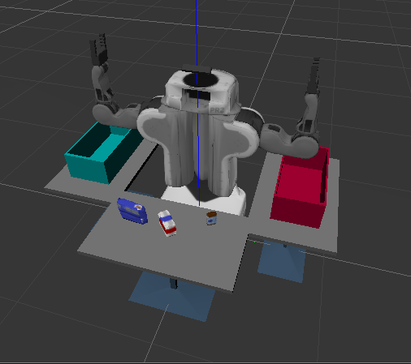
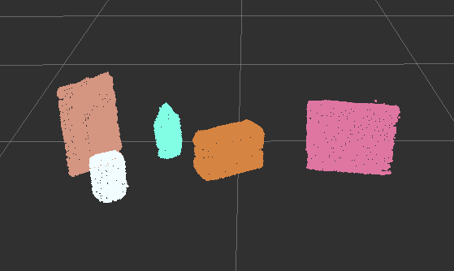
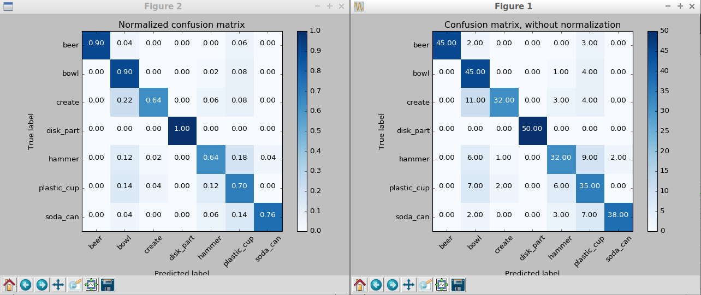
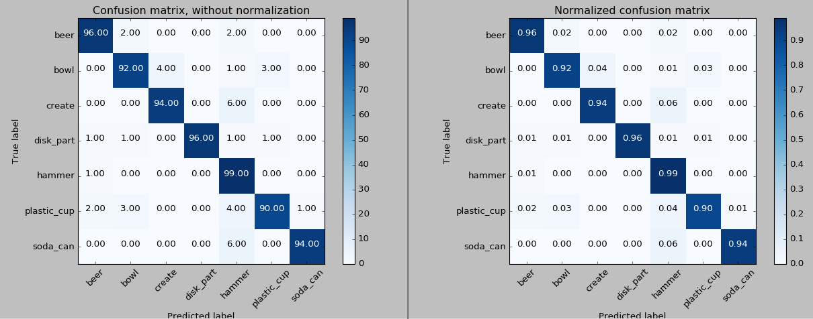
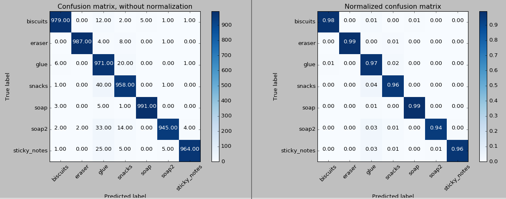
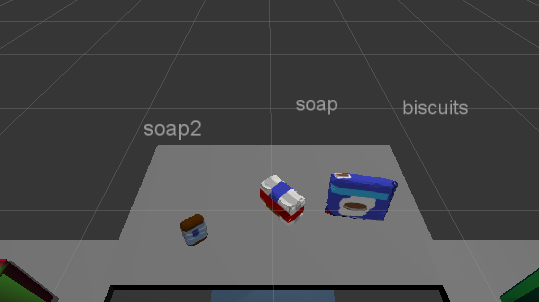

# Perception Pick and Place



In this project, we are given a simulation of a PR2 Robot with various objects in front of it.

The robot will look at these objects using a depth camera which should produce a point cloud, and identify each object properly before placing them in appropriate bins next to the robot.

The robot is given a list of objects and groups these objects belong to.

To do this task properly, we do the following sequence:

1. Filter and segment the point cloud so we ended up with several groups of point clouds, each belong to an object.
2. Meanwhile, train a classifier based on the objects' colors and shape. We are using a Support Vector Machine classifier (SVM) in this case. See Sklearn's [SVC](http://scikit-learn.org/stable/modules/generated/sklearn.svm.SVC.html) for more details.
3. Infer the objects by extracting features from their point clouds and pass them to our SVM classifier.
4. Move the arms to pick and place appropriate objects to their assigned dropboxes.

## How to run this project

If you wish to run the inference step directly without capturing the features and training the model, move all files in `output` to your `catkin_ws` directory.

### Step 0: Decide Which World to Operate On

Update the following settings:
- `pr2_robot/slaunch/pick_place_project.launch`: `world_name` parameter and `pick_list_*.yaml`
- `pr2_robot/scripts/capture_features.py`: `TEST_SCENE_NUM` and `TRAINING_SET_FILE`
- `pr2_robot/scripts/train_svm.py`: `TRAINING_SET_FILE` and `MODEL_FILE`
- `pr2_robot/scripts/project_template.py`: `TEST_SCENE_NUM`, `MODEL_FILE`, and `REQUEST_YAML_FILE`

Note: Prior to running anything, make sure to run `$ source catkin_ws/devel/setup.bash`.

### Step 1: Training the Object Recognizer

There are two parts here, creating training data and training the classifier.

#### Prepare Training Data

Launch the environment

```
$ roslaunch sensor_stick training.launch
```

Spawn training data

```
$ rosrun sensor_stick capture_features.py
```

The above steps should generate `catkin_ws/training_set.sav` file.

#### Train

```
$ rosrun sensor_stick train_svm.py
```

At the end of this step, `catkin_ws/model.sav` file should be created, which can be used for inference.

### Step 2: Infer Objects

Launch the environment

```
$ roslaunch pr2_robot pick_place_project.launch
```

And then, in another terminal:

```
$ rosrun pr2_robot project_template.py
```

To see if the objects point cloud was collected properly, look at Rviz's PointCloud2 object's `\pcl_cluster` topic.


## Write-up

### Filtering with RANSAC Plane Fitting + Segmentation

See the "Debugging" section above for how to run the segmentation process.

In this process, we are performing the steps in the following sequence:

1. Voxel Grid downsampling: Reduce the number of points for a faster processing.
2. Passthrough filter: Focus on area that contains the objects.
3. Extract outliers: Remove points that do not belong to any object.
4. RANSAC Plane Segmentation: Group the points that are likely to belong to each object.

Here is the result of this clustering process:



### Feature extraction and training an SVM classifier

We train the classifier by capturing features of each object, taken from various random angles.

Initially, I tried with 100 angles, which had resulted in the following performance:



The result was not too good, thus, as suggested by my mentor, I tried normalizing the plane normals i.e. by using the same range 0 to 256, similar to color values. The result had been greatly improved:



Just for kicks, I tried increasing the angles to 1000 angles per object which improved the performance a bit further:



### Perform Object Recognition

We then performed object recognition on various settings:

- Setting one with three objects (from left to right): soap2, soap, biscuits.
- Setting two with five objects: book, soap2, glue, soap, biscuits.
- Setting three with eight objects: eraser, sticky notes, glue, book, soap, soap2, biscuits, snacks.

And here are the results of each:

**World 1: 3/3 correct (100%)**


**World 1: 4/5 correct (80%)**


**World 1: 6/8 correct (75%)**


The exercise produces `request_[setting number].yaml` which may then be passed to the control system to perform picking and placing of objects. See the stored requests inside the `output` directory.